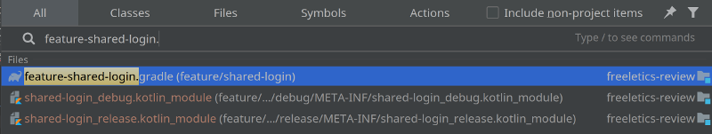

class: center, middle

# Make your life easier in Gradle multimodule project

.footnote[By _Yahor Berdnikau_: Android developer **@Freeletics**]

---

# Why to move from single module

- https://www.youtube.com/watch?v=opsiSaUS2bg
- https://proandroiddev.com/modularization-in-android-architecture-point-of-view-from-a-to-z-part-i-7a86e6e03799
- https://proandroiddev.com/intro-to-app-modularization-42411e4c421e
- https://jeroenmols.com/blog/2019/03/06/modularizationwhy/
- https://jeroenmols.com/blog/2019/03/18/modularizationarchitecture/

---

### Dependencies

``` gradle
dependencies {
    implementation fileTree(dir: 'libs', include: ['*.jar'])
    implementation 'com.android.support:appcompat-v7:27.1.1'
    implementation 'com.android.support:design:27.1.1'
    implementation 'com.android.support:recyclerview-v7:27.1.1'
    ...
}
```

---

### Dependencies (dependencies.gradle)

``` gradle
ext.versions = [
  androidGradlePlugin : '3.2.1',
  archComponents      : '1.1.1',
]

ext.gradlePlugins = [
  android :
    "com.android.tools.build:gradle:$versions.androidGradlePlugin",
]

ext.libraries = [
  archComponentsCommon :
    "android.arch.lifecycle:common-java8:$versions.archComponents",
  archComponentsViewModel  :
    "android.arch.lifecycle:viewmodel:$versions.archComponents",
]
```

---

### Dependencies (main build.gradle)

``` gradle
buildscript {
*   apply from: 'dependencies.gradle'

   classpath gradlePlugins.android
}

*apply from: 'dependencies.gradle'
```

---

### Dependencies (main build.gradle)

``` gradle
buildscript {
   apply from: 'dependencies.gradle'

*  classpath gradlePlugins.android
}

apply from: 'dependencies.gradle'
```

---

### Dependencies (some module build.gradle)

``` gradle
dependencies {
   implementation `libraries.archComponentsCommon`
}
```

---

### `api` vs `implementation`

https://docs.gradle.org/current/userguide/java_library_plugin.html#sec:java_library_separation - detailed explanation

--

Kotlin related issues:
- https://github.com/gradle/gradle/issues/5226
- https://youtrack.jetbrains.com/issue/KT-26305

---

### Modules/folder organization

- main app modules under project root
- feature modules in `feature/` folder
- core modules in `core/` folder
- helper test modules in `test/` folder

---

### Module bootstrap (kotlin-library-bootstrap.gradle)

``` gradle
apply plugin: 'java-library'
apply plugin: 'kotlin'

sourceCompatibility = JavaVersion.VERSION_1_8
targetCompatibility = JavaVersion.VERSION_1_8

dependencies {
    api libraries.kotlinStandardLibrary

    testImplementation libraries.junit
}
```

---

### Module bootstrap (android-library-bootstrap.gradle)

``` gradle
apply plugin: 'com.android.library'
apply plugin: 'kotlin-android'

android {
    compileSdkVersion CompileVersions.compileSdk
    defaultConfig {
        minSdkVersion versions.minSdk
        targetSdkVersion versions.targetSdk
    }
}

dependencies {
    api libraries.kotlinStandardLibrary
    testImplementation libraries.junit
}
```

---

### Module boostrap

Root `build.gradle`:
``` gradle
buildscript {
  ext.bootstrap = [
    kotlinLibrary  :
      "${project.rootDir}/kotlin-library-bootstrap.gradle",
    androidLibrary :
      "${project.rootDir}/android-library-bootstrap.gradle"
  ]
}
```

--

Any module `build.gradle`:
``` gradle
apply from: bootstrap.androidLibrary
```

---

### Auto add all modules

settings.gradle:
``` gradle
include \
    ':core:arch',
    ':core:clock',
    ':core:coach',
    ':core:logout',
    ':core:user-manager',
    ...
```

---

### Auto add all modules

``` gradle
def skipDirs = ~/^(build|…*|src|out|config)/
def preDir = {
    if (skipDirs.matcher(it.name).matches())
      return FileVisitResult.SKIP_SUBTREE
}

def getProjectName(String dir) {
    return (dir - (rootDir.toString() + '/')).replaceAll('/', ':')
}

*rootDir.traverse(type: FileType.DIRECTORIES, preDir: preDir) { dir->
    String dstr = dir.toString()
    if (new File(dstr + '/build.gradle').exists()) {
        logger.info("Including module from ${dstr}")
        include getProjectName(dstr)
    }
}
```

---

### Auto add all modules

``` gradle
def skipDirs = ~/^(build|…*|src|out|config)/
def preDir = {
    if (skipDirs.matcher(it.name).matches())
      return FileVisitResult.SKIP_SUBTREE
}

def getProjectName(String dir) {
    return (dir - (rootDir.toString() + '/')).replaceAll('/', ':')
}

rootDir.traverse(type: FileType.DIRECTORIES, preDir: preDir) { dir->
    String dstr = dir.toString()
*   if (new File(dstr + '/build.gradle').exists()) {
        logger.info("Including module from ${dstr}")
        include getProjectName(dstr)
    }
}
```

---

### Auto add all modules

``` gradle
def skipDirs = ~/^(build|…*|src|out|config)/
def preDir = {
    if (skipDirs.matcher(it.name).matches())
      return FileVisitResult.SKIP_SUBTREE
}

def getProjectName(String dir) {
    return (dir - (rootDir.toString() + '/')).replaceAll('/', ':')
}

rootDir.traverse(type: FileType.DIRECTORIES, preDir: preDir) { dir->
    String dstr = dir.toString()
    if (new File(dstr + '/build.gradle').exists()) {
        logger.info("Including module from ${dstr}")
*       include getProjectName(dstr)
    }
}
```

---

### Rename `build.gradle` in modules

.center[]

---

### Rename `build.gradle` in modules

``` gradle
...
*def getProjectBuildFile(String dir) {
*   return ((dir - (rootDir.toString() + '/'))
*     .replaceAll('/', '-')) + '.gradle'
*}

rootDir.traverse(type: FileType.DIRECTORIES, preDir: preDir) { dir->
   String dstr = dir.toString()
   if (new File(dstr + '/' + getProjectBuildFile(dstr)).exists()) {
        def projectName = getProjectName(dstr)
        include projectName
        project(':' + projectName).buildFileName =
          getProjectBuildFile(dstr)
    }
}
```

---

### Rename `build.gradle` in modules

``` gradle
...
def getProjectBuildFile(String dir) {
    return ((dir - (rootDir.toString() + '/'))
      .replaceAll('/', '-')) + '.gradle'
}

rootDir.traverse(type: FileType.DIRECTORIES, preDir: preDir) { dir->
   String dstr = dir.toString()
*  if (new File(dstr + '/' + getProjectBuildFile(dstr)).exists()) {
        def projectName = getProjectName(dstr)
        include projectName
        project(':' + projectName).buildFileName =
          getProjectBuildFile(dstr)
    }
}
```

---

### Rename `build.gradle` in modules

``` gradle
...
def getProjectBuildFile(String dir) {
    return ((dir - (rootDir.toString() + '/'))
      .replaceAll('/', '-')) + '.gradle'
}

rootDir.traverse(type: FileType.DIRECTORIES, preDir: preDir) { dir->
   String dstr = dir.toString()
   if (new File(dstr + '/' + getProjectBuildFile(dstr)).exists()) {
        def projectName = getProjectName(dstr)
        include projectName
*       project(':' + projectName).buildFileName =
*         getProjectBuildFile(dstr)
    }
}
```

---

### Rename `build.gradle` in modules

.center[]

---

### Module usage restriction

``` gradle
def limitModuleUsage(
  Project moduleProject,
  String allowOnlyInModules
) {
  rootProject.subprojects { subProject ->
    subProject.configurations.all {
*     allDependencies.withType(ProjectDependency.class) {
        if (it.dependencyProject == moduleProject &&
              !subProject.path.startsWith(allowOnlyInModules)) {
          throw new GradleException("..")
        }
      }
    }
  }
}
```

---

### Module usage restriction

``` gradle
def limitModuleUsage(
  Project moduleProject,
  String allowOnlyInModules
) {
  rootProject.subprojects { subProject ->
    subProject.configurations.all {
      allDependencies.withType(ProjectDependency.class) {
*       if (it.dependencyProject == moduleProject &&
*             !subProject.path.startsWith(allowOnlyInModules)) {
*         throw new GradleException("..")
        }
      }
    }
  }
}
```

---

### Module usage restriction

Internal module `build.gradle`:
``` gradle
limitUsageToModules(project, ":core")
```

---

### Task to create a new module

- https://discuss.gradle.org/t/gradle-task-prompt-for-password-how/25629

--

- https://github.com/Tapchicoma/ktsexec-gradle

---

### Links

All code samples:
- https://gist.github.com/Tapchicoma/6710098d1e55767fbc35467727ba0e67

Other:
- https://github.com/Tapchicoma/ktsexec-gradle
- https://docs.gradle.org/current/userguide/java_library_plugin.html#sec:java_library_separation
- https://github.com/gradle/gradle/issues/5226
- https://youtrack.jetbrains.com/issue/KT-26305
- https://discuss.gradle.org/t/gradle-task-prompt-for-password-how/25629
